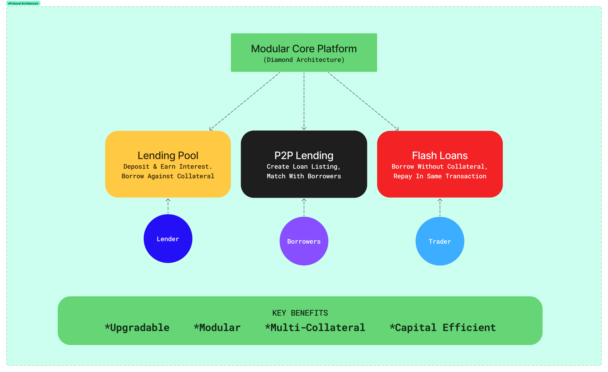

# vProtocol

vProtocol is a capital-efficient, yield-maximizing lending ecosystem that empowers users to define their own lending experience through a hybrid model combining P2P and liquidity pool lending.


## Overview

vProtocol isn't just another DeFi lending protocol; it's a revolutionary approach to decentralized lending that offers unprecedented flexibility, efficiency, and yield optimization. Our dual-model architecture combines the best aspects of peer-to-peer lending with traditional liquidity pool lending, all enhanced by smart matching algorithms and auto-debt rebalancing.

## Key Features

### Dual-Model Lending
- **P2P Lending:** Users can create custom lending terms including rates, duration, and collateral requirements
- **Liquidity Pool Lending:** Automated lending pools with dynamic interest rate models
- **Seamless Integration:** Users can switch between models or use both simultaneously based on market conditions

### Smart Matching Algorithm
- Instantly pairs lenders and borrowers based on compatible terms
- Prioritizes matches based on interest rates, collateral quality, and duration preferences
- Reduces capital inefficiency by minimizing idle funds

### Yield Optimization
- Dynamically shifts liquidity between P2P and LP models to maximize returns
- Auto-compounds interest when beneficial
- Optimizes collateral usage across loans

### Auto-Debt Rebalancing
- Continuously monitors market conditions and yield opportunities
- Automatically adjusts positions to maintain optimal capital efficiency
- Includes safety mechanisms and liquidation protection measures

### Custom Lending Pools
- Lenders can create pools with specific parameters
- Support for multiple collateral types in a single position

## Technical Architecture

vProtocol is built using the EIP-2535 Diamond Standard, providing exceptional modularity, upgradeability, and gas efficiency. The architecture consists of several key components:




### Core Modules
- **DiamondFacet:** Provides core Diamond functionality for upgrades
- **P2pFacet:** Manages peer-to-peer lending operations
- **LendingPoolFacet:** Handles liquidity pool operations
- **FlashLoanFacet:** Enables flash loan functionality
- **PauseableFacet:** Provides emergency controls
- **GettersFacet:** Exposes view functions for protocol state

### Components
- **Core Operations:** Deposits, withdrawals, borrowing, and repayments
- **State Management:** Interest rates, pool states, and reserve configurations
- **Asset Management:** Token vaults and interest accrual mechanisms
- **Risk Management:** LTV calculations, liquidation engine, and health factor monitoring

## Getting Started

### Prerequisites
- Foundry (forge, anvil, cast)
- Ethereum wallet (MetaMask recommended)

### Installation

1. Clone the repository
```bash
git clone https://github.com/vProtocol-on-Scroll/vProtocol-contract.git
cd vProtocol-contract
```

2. Install dependencies
```bash
forge install
```

3. Create a `.env` file with your environment variables
```
PRIVATE_KEY=your_private_key
ETHERSCAN_API_KEY=your_etherscan_api_key
RPC_URL=your_rpc_url
```

4. Build the project
```bash
forge build
```

### Deployment

1. Deploy to local network
```bash
anvil
forge script script/Deploy.s.sol --rpc-url http://localhost:8545 --broadcast
```

2. Deploy to testnet (Sepolia)
```bash
forge script script/Deploy.s.sol --rpc-url $RPC_URL --private-key $PRIVATE_KEY --broadcast --verify
```

## Testing

Run the comprehensive test suite:
```bash
forge test
```

Run coverage report:
```bash
forge coverage
```

Run gas report:
```bash
forge test --gas-report
```

## Security

vProtocol is being built with security as a top priority:

- Smart contract audits scheduled for Q2 2025
- Formal verification planned for critical components
- Bug bounty program to be announced before mainnet launch

## Roadmap

- **Q1 2025:** Beta Testers Program - Deploy vProtocol on testnet, open testing for early adopters
- **Q2 2025:** Security Audit & Mainnet Launch - Conduct smart contract audit, launch protocol on mainnet
- **Q3 2025:** Growth & Incentives - Introduce liquidity mining & rewards, expand adoption through incentives
- **Q4 2025:** Expand Product Line - Diversify offerings and revenue streams


## License

This project is licensed under the MIT License - see the [LICENSE](./LICENSE) file for details.

## Contact

- Website: [vprotocol.xyz](https://vProtocol.xyz)
- Twitter: [@vprotocol](https://x.com/FiveProtocol)
- Telegram: [Join our Beta-Testers program](https://t.me/+GvhDovtepY4yZTBk)

## Acknowledgements

vProtocol builds on the work of many DeFi pioneers, including:
- [Aave](https://aave.com/)
- [Compound](https://compound.finance/)
- [Morpho](https://morpho.org/)
- [EIP-2535 Diamond Standard](https://eips.ethereum.org/EIPS/eip-2535)